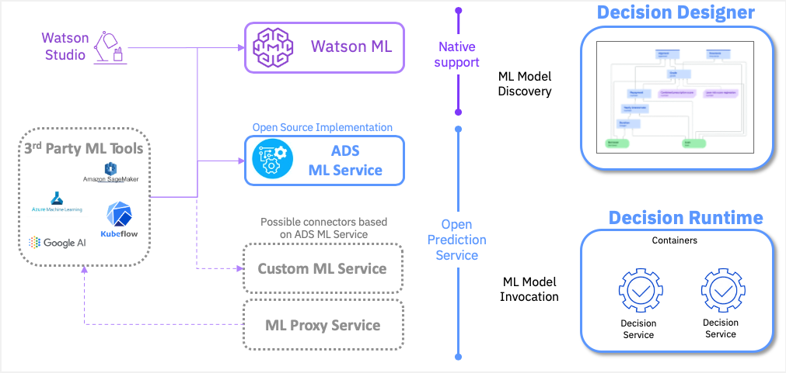

# Open Prediction Service

The Open Prediction Service API is an effort to provide an Open API that enables unsupported native ML Providers in Decision Designer or Decision Runtime.

We provide an Open Source implementation of this service based on two well known python Machine Learning SDK : [scikit-learn](https://scikit-learn.org/) and [XGBoost](https://xgboost.ai/) based on a docker container for easier deployments.

We also provide a Java SDK based on the Open Prediction Service API to enable any java based application to use this Open architecture.

## Open API specification

* [ ] Describe entry points
* [ ] Add Screen-shots

## ML Service

Instructions to build an use are inside the [ml-service](ml-service) folder.

## Open Prediction Service Java Client SDK

Instructions to build an use are inside the [ops-client-sdk](ops-client-sdk) folder.