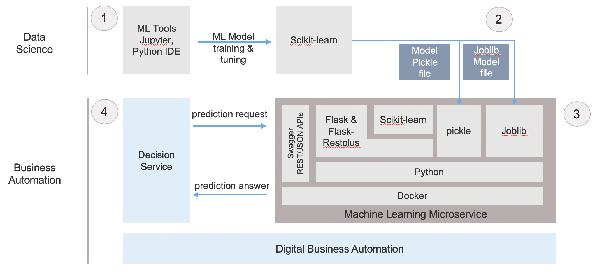

# Decision automation on machine learning

This repository includes sample material to show how IBM Decision Services can leverage ML predictive models hosted as micro services.

The technical proposal fits with a concept of operations based on 3 main roles and 4 steps:
 - Step 1: A Data scientist elaborates an ML model in a data science tool.
 - Step 2: A Data scientist exports an ML model serialized in pickle of joblib.
 - Step 3: A developer takes the serialized ML model and hosts it as a microservice
 - Step 4: A Business user creates a decision service in IBM Digital Business Automation that invokes the hosted ML model
 
 

The technologies selected here to fullfill a lightweight machine learning predictive model hosting are:
- Docker, as a container standard, used here to easily build and deploy a Python environment,
- Python, the de facto prefered language for ML,
- Flask and Flask-RESTPlus, frameworks bringing web app and RESTfull APIs,
- Pickle, a serialization for Python,
- JobLib, another serialization for Python.

This repository is composed of 3 projects:
- [ML model creation](src/dynamic_hosting/example_model_training/README.md): Several source files to create variations of ML models with scikit-learn to predict a default for a loan repayment. These models are stored in the file system through a pickle serialization or JobLib serialization.

- [A static RESTful ML microservice for scikit-learn models serialized in pickle](src/ml-model-static-hosting/README.md): A sample of a predictive microservice running a Random Forest Classification model to predict a default for a loan repayment. The ml model has been serialized with pickle. Features values are directly sent as http parameters. The microservice exposes an OpenAPI descriptor.

- [A generic REST ML microservice for scikit-learn models serialized in joblib](src/dynamic_hosting/README.md): A sample of a lightweight REST/JSON microservice to run multiple sklearn ML models captured as joblib files.

