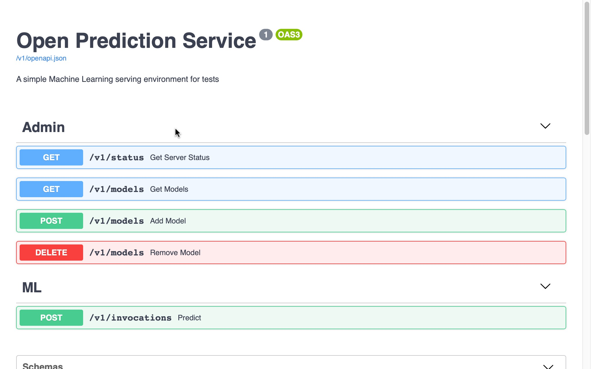
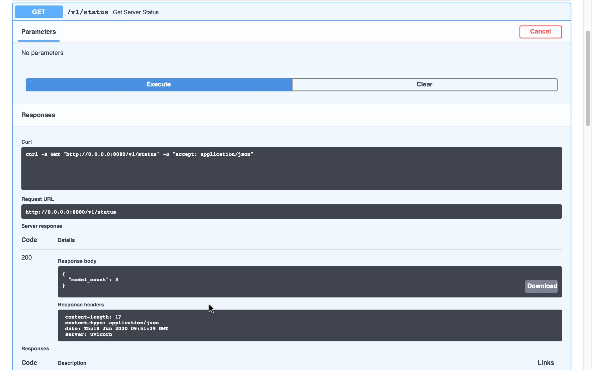
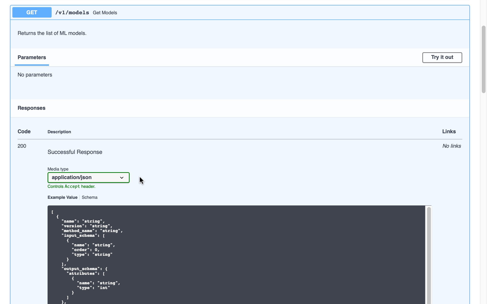

# Open Prediction Service

The Open Prediction Service API is an effort to provide an Open API that enables unsupported native ML Providers in Decision Designer or Decision Runtime.

We provide an Open Source implementation of this service based on two well known python Machine Learning SDK : [scikit-learn](https://scikit-learn.org/) and [XGBoost](https://xgboost.ai/) based on a docker container for easier deployments.

We also provide a Java SDK based on the Open Prediction Service API to enable any java based application to use this Open architecture.

## Open API specification

The Open Prediction Service is available as an [Open API v3 specification](open-prediction-service.json). The specification has three sections:

- *Admin* section for describing endpoints for uploading, getting or deleting models into the the server.
- *ML* section that covers the prediction call endpoint
- *Schemas* section for describing all the types manipulated byt the previous endpoints.

### *Admin* section

#### Status `/v1/status` `GET`

This endpoint can be used to test the availability of the service. It returns the number of models it is serving.

#### Models `/v1/models`

##### Retrieve `GET` 

This endpoint will return the list of the models it is serving.

##### Upload `POST`

This endpoint will allow to upload a pickle file as a new serving model.

##### Remove `DELETE`

##### 

This endpoint will remove a given model.

#### *ML* section

##### Call prediction `/v1/invocations` `POST`

## ML Service Implementations

We provide a reference implementation called `ads-ml-service`.

Instructions to build an use are inside the [ml-service-implementations/ads-ml-service](ml-service-implementations/ads-ml-service/README.md) folder.

## Open Prediction Service Java Client SDK

Instructions to build an use are inside the [ops-client-sdk](ops-client-sdk) folder.