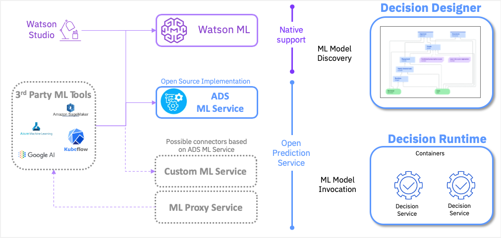

# Open Prediction Service HUB

This repository contains material and guidelines related to implementing [Open Prediction Service API](https://github.com/icp4a/automation-decision-services-extensions/tree/master/open-prediction-service) services.

The [Open Prediction Service API](https://github.com/icp4a/automation-decision-services-extensions/tree/master/open-prediction-service) is an effort to provide an OpenAPI that enables unsupported native ML Providers in Decision Designer or Decision Runtime.

Thanks to this service, as any third party ML tools can be integrated to match the API specifications, third party ML tools can be reached out the same way for ML model discovery and invocation in Decision Designer or Decision Runtime.
The Open Prediction Service API is suitable for both ML proxy service and custom ML service which provides a lot of flexibility and different level support.

In this repository we provide:

- a reference implementation for [scikit-learn](https://scikit-learn.org/) and [XGBoost](https://xgboost.ai/)
- a simple [scikit-learn](https://scikit-learn.org/) service with a step by step tutorial to reproduce it
- a IBM Watson Machine Learning and an Amazon SageMaker proxy service [Open Prediction Service API](https://github.com/icp4a/automation-decision-services-extensions/tree/master/open-prediction-service) implementation
- a Technology Compatibility Kit (TCK) to validate that a service complies with the expected [Open Prediction Service API](https://github.com/icp4a/automation-decision-services-extensions/tree/master/open-prediction-service)
- an Open Prediction Service Java Client SDK

## Reference implementation for [scikit-learn](https://scikit-learn.org/) and [XGBoost](https://xgboost.ai/)

We provide an Open Source implementation of this service based on two well known python Machine Learning SDK : [scikit-learn](https://scikit-learn.org/) and [XGBoost](https://xgboost.ai/) based on a docker container for easier deployments.

This reference implementation is called `ads-ml-service`.

Instructions to build an use are inside the [ops-implementations/ads-ml-service](ops-implementations/ads-ml-service/README.md) folder.

## Simple implementation for [scikit-learn](https://scikit-learn.org/)

We provide an Open Source implementation with step by step tutorial to reproduce it, based on a docker container for easier deployments.

This reference implementation is called `sklearn-service`.

Instructions to build an use are inside the [ops-implementations/sklearn-service](ops-implementations/sklearn-service/README.md) folder.

## Proxies

We provide two Open Source proxy implementation, based on a docker container for easier deployments:

- IBM Watson Machine Learning : [ops-implementations/wml-service](ops-implementations/wml-service/README.md)
- Amazon SageMaker : [ops-implementations/sagemaker-service](ops-implementations/sagemaker-service/README.md)

## TCK

We provide a Python TCK (Technology Compatibility Kit) [here](tck/README.md)

## Open Prediction Service Java Client SDK

We also provide a Java SDK based on the Open Prediction Service API to enable any java based application to use this Open architecture.

Instructions to build an use are inside the [ops-client-sdk](ops-client-sdk) folder.

## Contribute

Please read our [CONTRIBUTE](CONTRIBUTE.md) guidelines if you were to raise an issue, propose a new feature or contribute some code or documentation.

### License

Apache License Version 2.0, January 2004.
