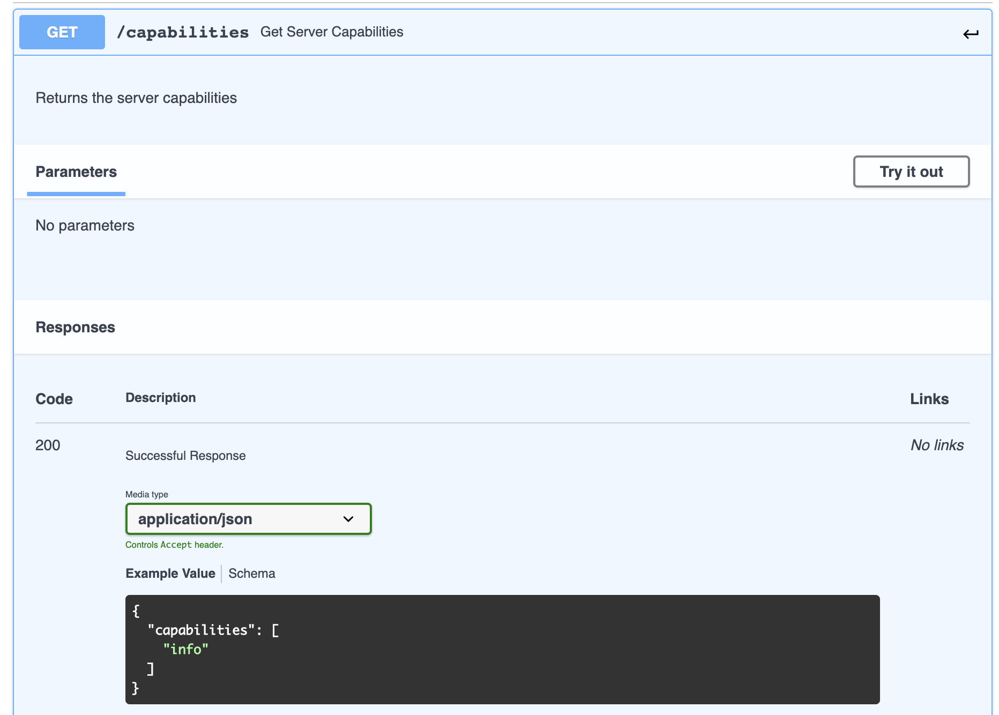
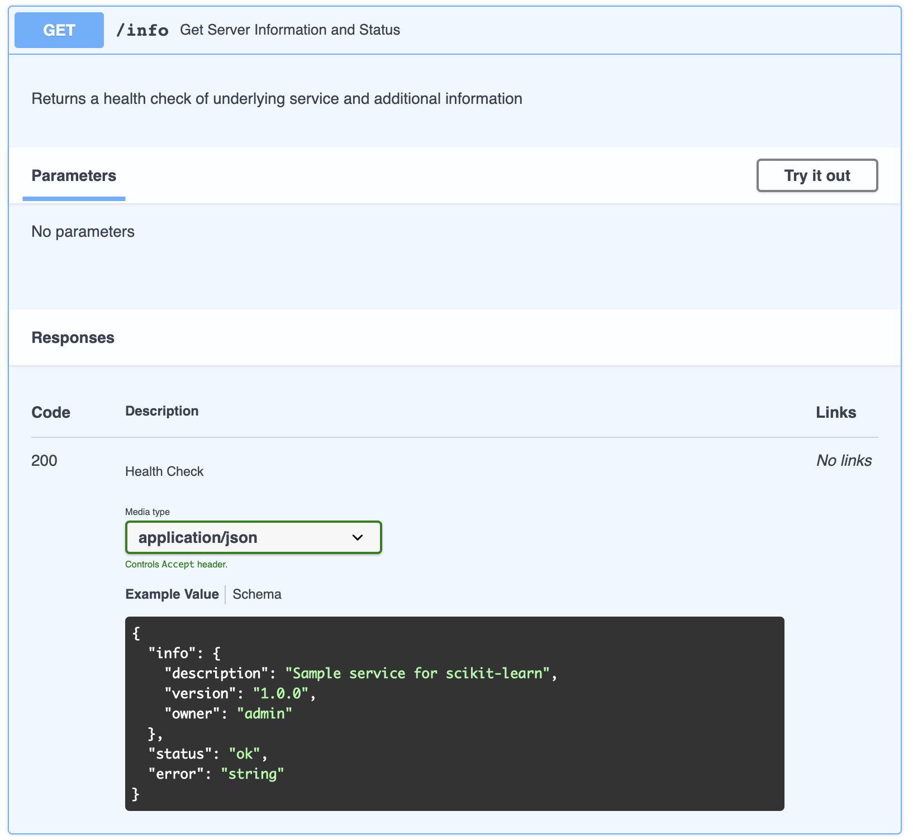
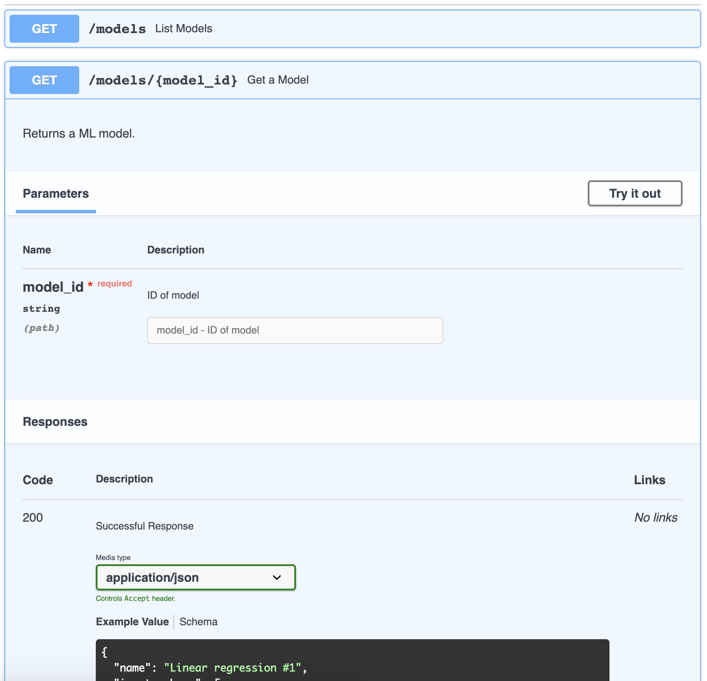
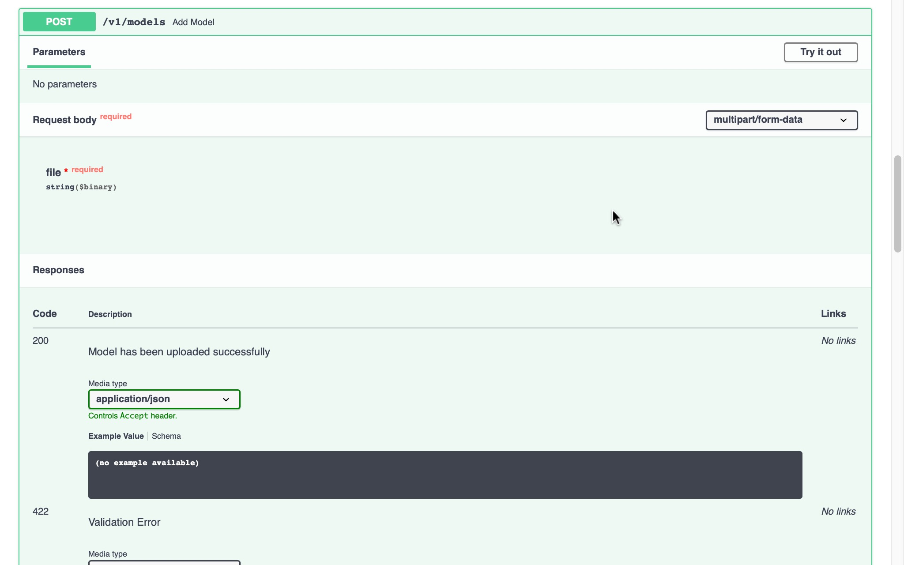
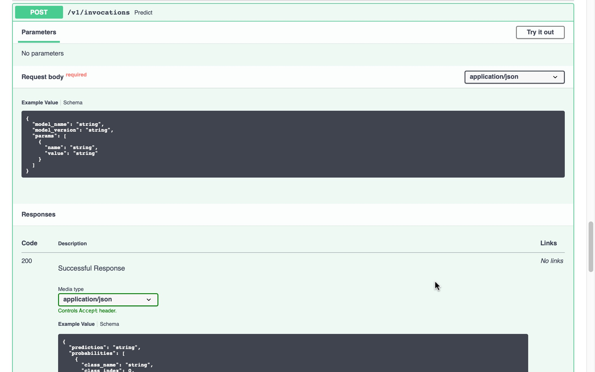

# Open Prediction Service

The Open Prediction Service API is an effort to provide an Open API that enables unsupported native ML Providers in Decision Designer or Decision Runtime.

Thanks to this service, as any third party ML tools can be integrated to match the API specifications, third party ML tools can be reached out the same way for ML model discovery and invocation in Decision Designer or Decision Runtime.
The Open Prediction Service API is suitable for both ML proxy service and custom ML service which provides a lot of flexibility and different level support.


In this repository we provide:
- a reference implementation for [scikit-learn](https://scikit-learn.org/) and [XGBoost](https://xgboost.ai/)
- an Open Prediction Service Java Client SDK

### Reference implementation for [scikit-learn](https://scikit-learn.org/) and [XGBoost](https://xgboost.ai/)

We provide an Open Source implementation of this service based on two well known python Machine Learning SDK : [scikit-learn](https://scikit-learn.org/) and [XGBoost](https://xgboost.ai/) based on a docker container for easier deployments.

This reference implementation is called `ads-ml-service`.

Instructions to build an use are inside the [ml-service-implementations/ads-ml-service](ml-service-implementations/ads-ml-service/README.md) folder.

### Open Prediction Service Java Client SDK
We also provide a Java SDK based on the Open Prediction Service API to enable any java based application to use this Open architecture.

Instructions to build an use are inside the [ops-client-sdk](ops-client-sdk) folder.

## Open API specification

The Open Prediction Service is available as an [Open API v3 specification](open-prediction-service.yaml). The specification has four main sections:

- *info* section for getting server information and capabilities.
- *discover* section for getting models and endpoints.
- *manage* section for adding, altering or deleting models and endpoints (If implemented).
- *run* section for model invocation

All the types manipulated by the different endpoints are described in the *Schemas* section below.

<!---
Python tests based on *pytest* are provided to insure integration in Decision Designer or Decision Runtime.

``` bash
pytest api-tests/ --url <ENPOINT_URL>

# For example:
pytest api-tests/ --url http://localhost:8080/
```
-->


### *info* section

#### `/capabilities` `GET`



This endpoint can be used to get a list of supported operation 
(any subset of `{info, discover, manage, run}`) of the service.

#### `/info` `GET`



This endpoint can be used to test the availability of the service. 
It returns runtime information.

### *discovery* section

This section is used to retrieve model & endpoint information. 

* `/models[/{model_id}]` `GET`
* `/endpoints[/{endpoint_id}]` `GET`




Those endpoints will return the selected resources. Model is the
input/output signature of predictive model and Endpoint is the "binary model".
A predictive model is the combination of a model and an endpoint.

##### Upload `POST`



This endpoint will allow to upload a pickle file as a new serving model.

##### Remove `DELETE`

##### 

This endpoint will remove a given model.

#### *ML* section

##### Call prediction `/v1/invocations` `POST`



### License
Apache License Version 2.0, January 2004.