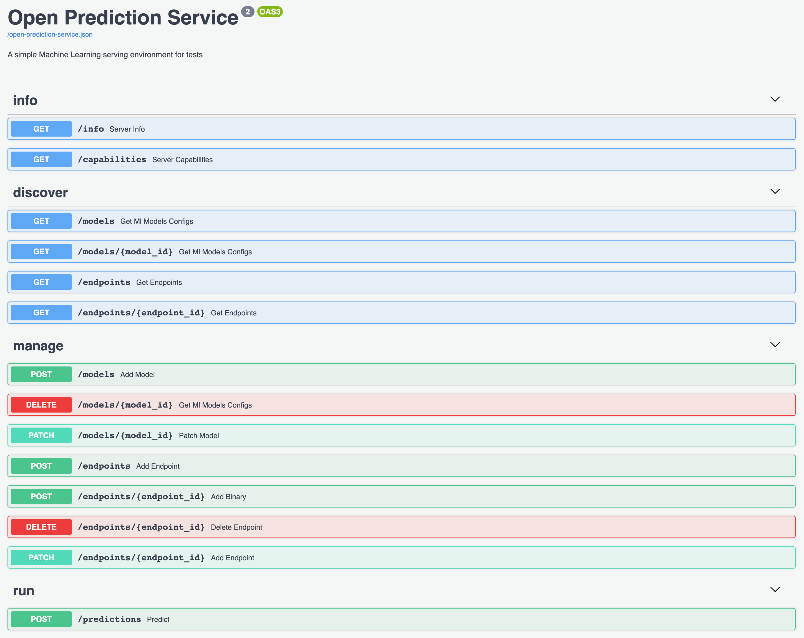

# OPS with scikit and xgboost sample

0. [Installation](doc/installation/README.md)

1. [Getting Started](#getting-started)

2. [Open Prediction Service](#open-prediction-service)

3. [Additional Dependencies](#additional-dependencies)

4. [Model Examples](#model-examples)


## Getting Started

### Prerequisites

Docker

### Run the microservice
To build the microservice image

```sh
docker build -t ads-ml-service .
```

To run the microservice

```sh
docker run --rm --read-only -it -p 8080:8080 --name ads-ml-service ads-ml-service
```

To check that you have a running container
```sh
docker ps ads-ml-service
```

> Your predictive service is available at [http://localhost:8080/](http://localhost:8080/).

> Swagger UI documentation is available at [http://localhost:8080/docs](http://localhost:8080/docs) or [http://0.0.0.0:8080/redoc](http://0.0.0.0:8080/redoc)

### Stop the microservice
To stop the container
```sh
docker stop ads-ml-service
```

## Open Prediction Service

Different endpoints are available and documented at [http://localhost:8080/docs](http://localhost:8080/docs).



For example you can list all added models by running:
```sh
curl -X GET "http://localhost:8080/models" -H "accept: application/json"
```

### Configuring a predictive model

The predictive model is a combination of a model and an endpoint. A model
represents the question for which the predictive model needs to solve. An endpoint
contains a trained model which solves a specific question. 
A very good analogy is that model defines an function interface and 
endpoint defines different implementations of the interface. For this reason,
before adding an endpoint, we need to define the model.

#### Add a model `/models` `POST`

The request body of the model adding request is a simple json object.

Structure of json object:

```
└── Dict
    ├── 'name': 'model name'    // required
    ├── 'input_schema'          // although not required, It is recommended to configure the input scheme
        └── Array
            └── Dict
                ├── 'name'
                ├── 'order'
                └── 'type'
    ├── 'output_schema':        // not required
        └── Dict
            └── feature_name
                └── Dict
                    └── 'type'
    └── 'metadata':             // although not required, it is recommended to add some metedata for model
        └── Dict                // metadata accepts all key-value pairs
            ├── 'description': 'model description'
            ├── 'author': 'model author'
            ├── 'trained_at': '2020-03-17 13:25:23'
            └── 'metrics':
                └── Array
                    └── Dict
                        ├── 'name'
                        └── 'value'
```

#### Add an endpoint `/endpoints` `POST`

After adding model information, if success, it can be listed by `/models` `GET`.
This will give you important information about model which is added 
during model creation: the "id" of the model.

The request body of the endpoint adding request is also a simple json object.

Structure of json object:

```
└── Dict
    ├── 'name': 'model name'    // required
    ├── 'status': 'creating'    // required
```

After adding endpoint metadata, if success, it can be listed by `/endpoints` `GET`.
You can also get the `ìd` of the previous added endpoint.

The last step is to upload model binary to `/endpoints/{endpoint_id}` `POST`. Do not
forget chose the type of binary (`skl`: scikit-learn predictor, `xgb`: XGBoost saved model)

#### Configuration example for miniloan fraud detection

Model Configuration:

```json
{
  "name": "[sample][miniloan-dataset][RandomForestClassifier] loan approval example",
  "version": "v1",
  "input_schema": [
    {
      "name": "creditScore",
      "order": 0,
      "type": "float64"
    },
    {
      "name": "income",
      "order": 1,
      "type": "float64"
    },
    {
      "name": "loanAmount",
      "order": 2,
      "type": "float64"
    },
    {
      "name": "monthDuration",
      "order": 3,
      "type": "float64"
    },
    {
      "name": "rate",
      "order": 4,
      "type": "float64"
    }
  ],
  "output_schema": {
      "predictions": {
        "type": "string"
      },
      "scores": {
        "type": "[float]"
      }
  },
  "metadata": {
    "description": "Loan payment classification",
    "author": "Somebody",
    "trained_at": "2020-03-17 13:25:23",
    "metrics": [
      {
        "name":  "accuracy",
        "value": 0.9471577261809447
      }
    ]
  }
}
```

Endpoint configuration:

```json
{
    "name": "[sample][miniloan-dataset][RandomForestClassifier] example endpoint for loan approval",
    "status": "creating"
}
```

### Invoking a model - `/predictions` `POST`

The request body of the invocation request is a JSON object with the following structure.
```
└── Dict
    ├── 'target'
        └── Array
            └── Dict
                ├── 'ref': 'endpoint'
                └── 'href' 'href': '/endpoints/{id}'
    └── 'params'
        └── Array
            └── Dict
                ├── 'name'
                └── 'value'
```

`{id}` is the id of the endpoint

#### Example of model invocation

Request body
```json
{
  "target": [
    {
      "rel": "endpoint",
      "href": "/endpoints/4"
    }
  ],
  "parameters": [
    {
      "name": "creditScore",
      "value": 200
    },{
      "name": "income",
      "value": 50000
    },{
      "name": "loanAmount",
      "value": 50000
    },{
      "name": "monthDuration",
      "value": 48
    },{
      "name": "rate",
      "value": 2.8
    }
  ]
}
```

Response body may look like:
```json
{
  "result": {
    "predictions": "true",
    "scores": [
      0.2016910870991424,
      0.7983089129008577
    ]
  }
}
```


## Additional Dependencies
* Dependencies for web service: `requirements.txt`
* Dependencies for ML model: `requirements-ml.txt`

Before adding new models, make sure that `requirements-ml.txt` already contains
all necessary dependencies.

If new dependencies are added, you need to stop the running container and build the image again (see [Getting Started section](#getting-started))


## Model Examples

You can find examples of models ready to be added to your OPS instance in 
[examples/model_training_and_deployment/](examples/model_training_and_deployment/README.md) folder.


## Configure pre-loaded model
ads-ml-service preloads some sample models. This behaviour can be configured by
`preload-conf.yaml`.

A pre-loaded model needs to:
1. have a deployment configuration file `deployment_conf.json` located in the same directory
2. have a binary model `model.pkl` or `model.bst` (**\[Optional\]** binary model can be replaced by a `train.py`)
3. register its relative (relative to `ads-ml-service/`) path in `preload-conf.yaml`

## Configure custom python modules
Additional python modules can be added in `custom_modules`. Modules and packages in this
directory can be imported during model invocation. 
