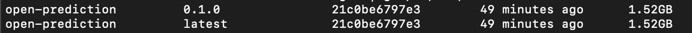
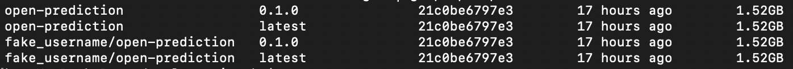

# Installation

OPS is a containerized service. Installation consist of two steps: 
1. Build image from source code. (Register image to image registry)
2. Create services using registered/local image

## Build image

Build the image in 3 lines:
```shell script
# Clone the project
git clone git@github.ibm.com:dba/automation-decision-services-extensions.git automation-decision-services-extensions

# Build image
cd automation-decision-services-extensions/open-prediction-service/ml-service-implementations/ads-ml-service
docker build -t open-prediction:0.1.0 -t open-prediction:latest -f Dockerfile .
```
The image is then built and can be identified by two tags: `0.1.0` and `latest`.

To verify, tap
```shell script
docker images | grep open-prediction
```

and you will see:


## Register image to image registry (Optional for local deployment)

Suppose you have a docker hub account 
(e.g. username: `fake_username`, email: `fake_email@example.com`)

Images in public registry needs to contain user name. Add new tags for the image.
```shell script
docker tag open-prediction:0.1.0 fake_username/open-prediction:0.1.0
docker tag open-prediction:latest fake_username/open-prediction:latest
```

To verify, tap
```shell script
docker images | grep open-prediction
```

and you will see:


Login your docker hub account

```shell script
docker login --username=fake_username --email=fake_email@example.com
```

Then you will see some thing like

```shell script
WARNING: login credentials saved in /home/username/.docker/config.json
Login Succeeded
```

Finally, push image to docker hub

```shell script
docker push fake_username/open-prediction:0.1.0
docker push fake_username/open-prediction:latest
```

Your image is now available for non local environments 

## Create service
