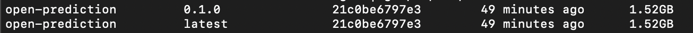
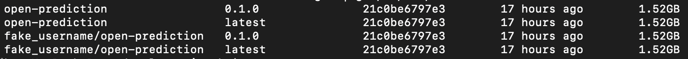
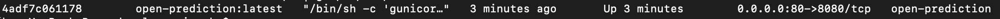
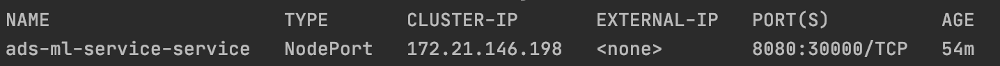

# Installation

ADS-ML-Service is a containerized service. Installation consist of three steps: 
1. Building an image from source code.
2. Registering image to image registry (Optional for local deployment).
3. Creating services using registered/local image.

## Build image

Build docker image from GitHub repository.
```shell script
docker build \
  -t open-prediction:0.1.0 \
  -t open-prediction:latest \
  https://github.com/IBM/open-prediction-service-hub.git#main:ops-implementations/ads-ml-service
```
The image is then built and can be identified by two tags: `0.1.0` and `latest`.

To verify, run
```shell script
docker images | grep open-prediction
```

And you will see:



## Register image to image registry (Optional for local deployment)

Suppose you have a docker hub account 
(e.g. username: `your_username`, email: `your_email@example.com`)

Images in public registry need to contain user name. Add new tags for the image.
```shell script
docker tag open-prediction:0.1.0 your_username/open-prediction:0.1.0
docker tag open-prediction:latest your_username/open-prediction:latest
```

To verify, run
```shell script
docker images | grep open-prediction
```

Then you will see some thing like


Login your docker hub account
```shell script
docker login --username=your_username --email=your_email@example.com
```

Then you will see some thing like
```shell script
WARNING: login credentials saved in /home/username/.docker/config.json
Login Succeeded
```

Finally, push image to docker hub.
```shell script
docker push your_username/open-prediction:0.1.0
docker push your_username/open-prediction:latest
```

Your image is now available for non-local environments.

## Create service

This tutorial will not cover more advanced topics such as creating a K8S 
service with cloud platform provided database and ingress controller.
The OpenShift/K8S example is a single node service with local storage. It could
be extended but that is more advanced than this tutorial.
Instead, this tutorial will focus on local deployment with Docker/docker-compose.

### Number of workers

The number of worker can be configured by environment variable `GUNICORN_WORKER_NUM` or `WEB_CONCURRENCY`. THe default 
worker number is `2`.

### Volumes

Data and configuration files are stored in docker volumes and could be
persisted. There are two of them:

1. `/var/lib/ads-ml-service/models` is used to store models and model configurations.
2. `/var/log/ads-ml-service` is used to store logs

### 1. Local service

ADS-ML-Service can use internal storage (`/var/lib/ads-ml-service/models`)
or external database. Let's begin with the simplest use case, ADS-ML-Service
with internal storage.

#### Run service with local storage

Run this command in the same directory of this README file. 

```shell script
docker run \
  --detach \
  --restart=always \
  --publish 80:8080 \
  --name open-prediction \
  --env USE_SQLITE="True" \
  --volume $(pwd)/example_volume/models:/var/lib/ads-ml-service/models \
  --volume $(pwd)/example_volume/logs:/var/log/ads-ml-service \
  open-prediction:latest
```

To verify, run
```shell script
docker ps -f name=open-prediction
```

Then you will see something like


#### Run service with remote database

Local storage approach fails when multi-node supported is needed. Each instance
of ADS-ML-Service uses its own database thus the synchronization will be lost.
The solution is to let them share the same database.

There are three environment variables to be configured:
1. `USE_SQLITE=False` disable local storage
2. `DB_URL` database URL
3. `DB_ARGS` additional arguments for `sqlalchemy`

Here is a docker-compose example of ADS-ML-Service with postgresql.
Run this command in the same directory of this README file.

```shell
export POSTGRES_PASSWORD="<database password>"
export VIRTUAL_HOST="<host-name>"
docker-compose up
```

There are two additional parameters:
1. `POSTGRES_PASSWORD` used to init a database. In this example it can be 
   as simple as `my_db_passwd`
2. `VIRTUAL_HOST` used by nginx for load balancing. 
   In this example it can be `localhost`
   
You will get a working ADS-ML-Service instance after this command.

Services created by both method can be accessed through `http://localhost`. 

### 2. Kubernetes/OpenShift cluster

This part is not designed to offer a fine-tuned ops cluster, but
a minimum example of working ops instance (local storage).

#### 2.1 OpenShift

Although instances can be created in exactly the same way as using kubectl, 
the cli tool offered by OpenShift really simplifies the entire workflow.

Create a working instance in 3 lines:
```shell script
# 1.1 Create kubernetes namespace for OPS
oc new-project ads-ml-service
# 1.2 If namespace already exists
oc project ads-ml-service

# 2. Create kubernetes service and associated deployment for OPS
oc new-app \
  https://github.com/icp4a/automation-decision-services-extensions#master \
  --name ads-ml-service \
  --context-dir open-prediction-service/ml-service-implementations/ads-ml-service
  
# Expose service to external clients (If ADS client is not in the same cluster)
oc expose service/ads-ml-service
```

#### 2.2 kubernetes

Suppose you have a working kubernetes cluster and have configured kubectl
properly. To verify that, run `kubectl cluster-info`, your nodes should be listed.

`deployment.yaml` and `service.yaml` are available in `ads-ml-service/kubernetes`.
There is one remaining configuration to be done: `{{IMAGE_URL}}` inside `deployment.yaml` has not been configured yet.
Replace it by the image URL you got in [Register image to image registry](#register-image-to-image-registry-optional-for-local-deployment) section.

After replacing `{{IMAGE_URL}}`, apply configurations:

```shell script
kubectl apply -f kubernetes/deployment.yaml
kubectl apply -f kubernetes/service.yaml
```

Find service address by:

```shell script
kubectl get service ads-ml-service-service
```

Then you will see some thing like


ads-ml-service is available at `<none>` (if it works, `<none>` is replaced by a valid IP address) on port `30000`.

If that does not work, try `kubectl get nodes -o yaml | grep external-ip`

you will get something like:

```shell script
ibm-cloud.kubernetes.io/external-ip: xxx.xxx.xxx.xxx
```

ads-ml-service is available at `xxx.xxx.xxx.xxx` on port `30000`.


# Security configuration [Experimental]

<strong>This is an experimental feature and is not activated by default. Interfaces might change
during development.</strong>

Authentication and authorization is achieved by using username/password and 
JWT tokens. Meanwhile, to prevent man-in-the-middle attack,
[HTTPS](https://en.wikipedia.org/wiki/HTTPS) needs to be configured. 
[TLS termination proxy](https://en.wikipedia.org/wiki/TLS_termination_proxy) 
is the recommended way
(e.g [traefik](https://docs.traefik.io/) and [caddy](https://caddyserver.com/)).

Some details:
*   During initialization defined in `entrypoint.sh`, default user (can be configured by environment 
    var `DEFAULT_USER` and `DEFAULT_USER_PWD`) and example models are added. Default values for username and password 
    are `admin` and `password`. 
*   JWT HMAC secret key is generated using standard library secrets during server initialization.

## Configure ops credentials

Suppose you want to create a user with name `toto` and password `titi`.

### OpenShift

You can achieve this simply by overriding the service creation command:

```shell script
oc new-app \
  https://github.com/icp4a/automation-decision-services-extensions#master \
  --name ads-ml-service \
  --context-dir open-prediction-service/ml-service-implementations/ads-ml-service \
  DEFAULT_USER=toto \
  DEFAULT_USER_PWD=titi
```

### Kubernetes

Suppose you want to do the same thing using `kubectl`. First you need to create
K8S secret object.

```shell script
kubectl create secret generic ops-user-creds \
      --from-literal=DEFAULT_USER=toto\
      --from-literal=DEFAULT_USER_PWD=titi
```

you will see:
```
secret/ops-user-creds created
```

Finally replace the old deployment file `deployment.yaml` by `deployment_custom_pwd.yaml`:
```
kubectl apply -f kubernetes/deployment_custom_pwd.yaml
```

### Local service 

Replace the command by:

```shell script
docker run --detach --restart=always \
  --publish 80:8080 \
  --read-only \
  --name open-prediction \
  -e DEFAULT_USER=toto \
  -e DEFAULT_USER_PWD=titi \
  open-prediction:latest
```

## Configure HTTPS

TLS and mTLS can be configured by using environment variables. All parameters have defaults and are optional.

| Variable                         | Description                                                                                          | Default              |
| -------------------------------- | ---------------------------------------------------------------------------------------------------- | -------------------- |
| `TLS_CRT`                        | Path to pem encoded TLS secret certificate. TLS will be disabled if empty                            |      empty           |
| `TLS_KEY`                        | Path to pem encoded TLS secret key. TLS will be disabled if empty                                    |      empty           |
| `CA_CRT`                         | Path to pem encoded Trusted certificates. Mutual TLS authentication will be disabled if empty        |      empty           |
| `HTTPS_PORT`                     | Https port, must be different from `HTTP_PORT`                                                       |      8443            |
