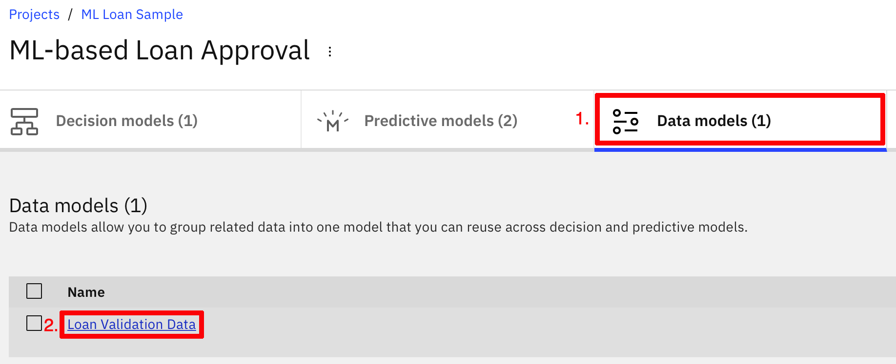
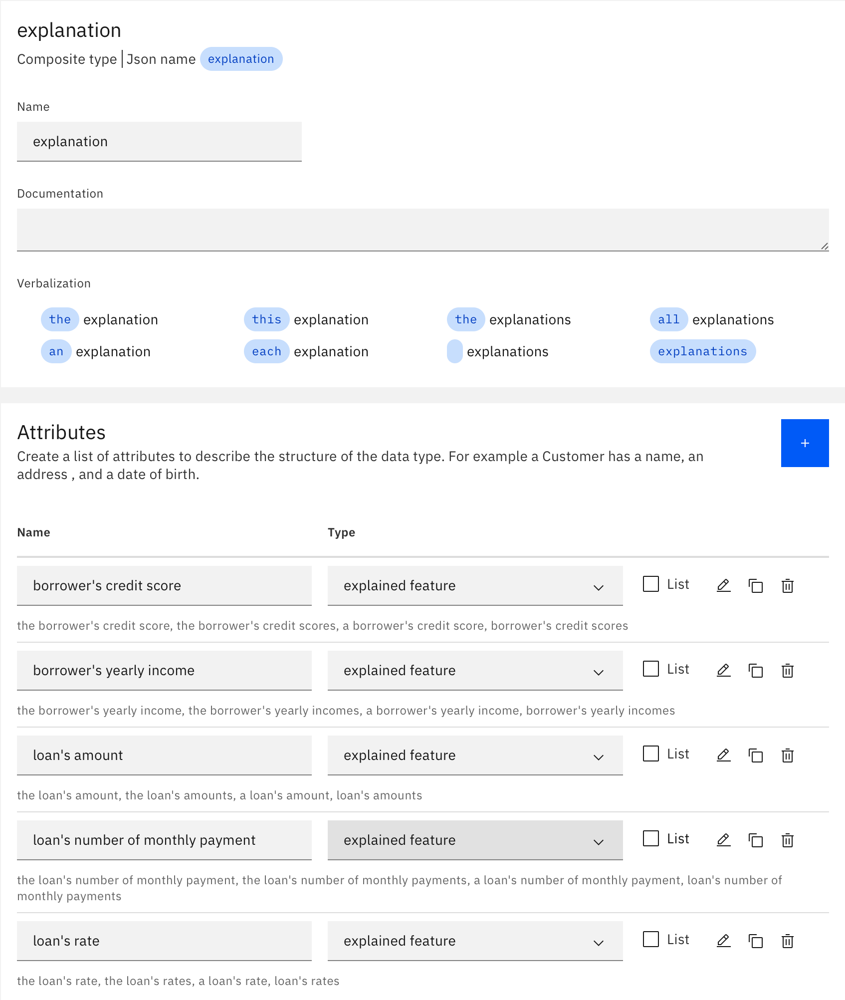
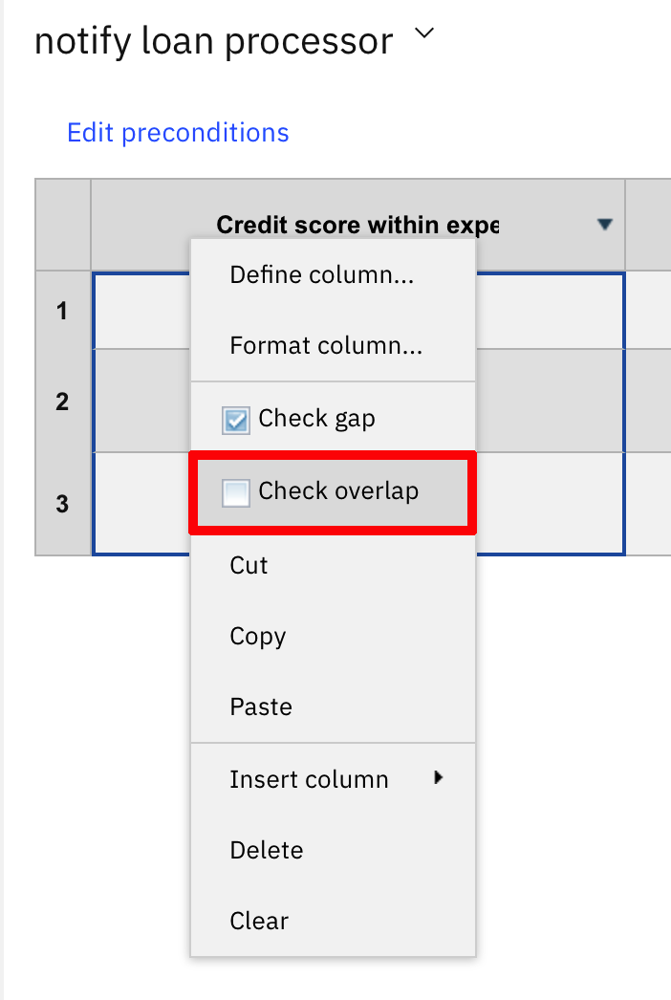

# Technical contribution: Infusing decisions with explainable predictions

## Description

This technical contribution shows you how to use the lime open source package to enrich your decision model's predictions with _Local Interpretable Model-Agnostic Explanations_.

lime computes a linear approximation for the local prediction you are interested in. lime explanations thus correspond to the weights of each input feature for this approximated linear model.
Each of these weights indicates how much the corresponding input feature actually contributes to the predicted outcome.  

Finally, bear in mind that lime computes explanations by generating random perturbations around the prediction.
These may account for slightly different numerical weights being computed for the same prediction:
   - **lime explanations are not 100% deterministic**.
   - However, the magnitude of the weights and their relative importances should be approximately the same.


For instance, the above explanation visualization generated by lime illustrate that:
   - Our model predicts a payment default (_Default_ label), with a probability of 0.55.
   - The value of 113,710 for the _loanAmount_ input feature contributes _positively_ for 36% in the _payment default_ predicted outcome
      - If you were to increase the loan amount, this will _increase_ the likeliness of a payment default being predicted. 
   - Whereas the value of 14,159 for the _income_ input feature contributes _negatively_ for 20% in the same predicted outcome. 
      - If you were to increase the income, this will _decrease_ the likeliness of a payment default being predicted. 

# Prerequisites

- [ ] This technical contribution was built upon [**Automation Decision Services 20.0.3**](https://www.ibm.com/support/knowledgecenter/en/SSYHZ8_20.0.x/com.ibm.dba.offerings/topics/con_aid.html). If you are trying it on a more recent version, the provided detailed instructions might not be accurate anymore (out-of-date screenshots, user interface changes, etc.).
  
- [ ] We assume you've completed the sample [_Using machine learning to make better decisions_](https://github.com/icp4a/automation-decision-services-samples/blob/20.0.3/samples/MLStart/README.md). Either the short path, or the full path (at least until [_Task 3: Using the predictive model in the decision model_](https://github.com/icp4a/automation-decision-services-samples/blob/20.0.3/samples/MLStart/README.md#task-3-using-the-predictive-model-in-the-decision-model).
You should now have successfully configured, tested and used a predictive model a decision model.

- [ ] This technical contribution is an [Open Prediction Service (OPS)](https://github.com/icp4a/automation-decision-services-extensions/tree/20.0.3/open-prediction-service) implementation. Thus you should be familiar with the corresponding concept and APIs.  

- [ ] This OPS implementation is a [python 3.5.2+](https://www.python.org) application.

- [ ] It is deployed as a [docker](https://www.docker.com) container.

# References
- The ADS sample [_Using machine learning to make better decisions_](https://github.com/icp4a/automation-decision-services-samples/blob/20.0.3/samples/MLStart/README.md). 
- The [Open Prediction Service](https://github.com/icp4a/automation-decision-services-extensions/tree/20.0.3/open-prediction-service) specifications
- The [Open Prediction Service HUB](https://github.com/IBM/open-prediction-service-hub) hosts OPS development toolkit and implementations
- [python](https://www.python.org)
- [docker](https://www.docker.com)
- [lime open source package](https://github.com/marcotcr/lime)

# Task 1 : Setting up this technical contribution

You build your OPS application with python 3.X. You then deploy it as docker container. Finally, you create a new machine learning provider in ADS to connect to your deployed OPS application. 

This OPS implementation does not have any _manage_ capabilities. It only provides `info`, `discover` and `run` capabilities
```json
{
  "capabilities": [
    "info",
    "discover",
    "run"
  ]
}
```
It defines 2 OPS models, _Model for payment default prediction with flat explanation_ and _Model for payment default prediction with explanation as object_, with one deployment each.
Those 2 models actually share the same trained, hard-coded model which is the one defined in the [_Predict loan default with PMML in WML.ipynb_](https://github.com/icp4a/automation-decision-services-samples/blob/20.0.3/samples/MLStart/model/Predict%20loan%20default%20with%20PMML%20in%20WML.ipynb) Jupyter notebook from the ADS sample _Using machine learning to make better decisions_.
The only difference between those 2 OPS models and their respective deployments is how lime explanations are returned: 
- The first model's deployment returns _flat explanations_: 
```json
{
  "result": {
    "creditScore_explanation": -0.022417112088458816,
    "income_explanation": -0.23995394095100656,
    "loanAmount_explanation": 0.324763610296105,
    "monthDuration_explanation": 0.021835703671488307,
    "predicted_paymentDefault": 1,
    "probability_0": 0.14001285831034438,
    "probability_1": 0.8599871416896556,
    "rate_explanation": -0.023409477309849734,
    "yearlyReimbursement_explanation": 0.03475562265671785
  }
}
```
- Whereas the second model's deployment returns an explanation object: 
```json
{
  "result": {
    "explanation": {
      "creditScore": -0.019273544151277883,
      "income": -0.2379334500305462,
      "loanAmount": 0.33497491987987144,
      "monthDuration": 0.02122238773391723,
      "rate": -0.017785062196728263,
      "yearlyReimbursement": 0.029053540538483826
    },
    "predicted_paymentDefault": 1,
    "probability_0": 0.14001285831034438,
    "probability_1": 0.8599871416896556
  }
}
```
Here is a sample payload for the `POST /predictions` endpoint:
```json
{
	"parameters": [{
			"name": "creditScore",
			"value": 792
		},
		{
			"name": "income",
			"value": 179930
		},
		{
			"name": "loanAmount",
			"value": 466792
		},
		{
			"name": "monthDuration",
			"value": 28
		},
		{
			"name": "rate",
			"value": 0.09
		},
		{
			"name": "yearlyReimbursement",
			"value": 46143.34
		}

	],
	"target": [{
		"href": "http://open-prediction-service.org/endpoints/1",
		"rel": "endpoint"
	}]
}
```

**About this task**

In this task, you...
- Build this Open Prediction Service implementation application
- Deploy your application's container so that it can be reached by the [IBM Automation Decision Service](https://www.ibm.com/support/knowledgecenter/en/SSYHZ8_20.0.x/com.ibm.dba.aid/topics/con_aid_intro.html) instance you are using.
- Create a new machine learning provider connecting to your deploy OPS application

## Step 1: Build the OPS application
### Python
- Install the required dependencies:
```
pip3 install -r requirements.txt
```
- Run the server:
```
python3 -m openapi_server
```
- Explore and test the implemented OPS API with [OpenAPI Swagger UI](http://localhost:8080/ui) 
- Download the corresponding [OpenAPI specifications](http://localhost:8080/openapi.json)

### Docker
- Build the docker image
```bash
docker build -t openapi_server .
```
- Start up the docker container
```bash
docker run -p 8080:8080 openapi_server
```

## Step 2: Deploying your OPS application

This technical contribution doesn't currently provide detailed instructions about deployment to a public or private cloud.  

## Step 3: Testing your deployed OPS application

You can test your deployed OPS application REST API
- Either through its Open API Swagger UI  (by default available at `https://hostname:port/openapi.json`).
- Or directly with tools like Postman or cURL.

## Step 4: Defining an OPS machine learning provider

You create a machine learning provider to get your model deployment into your decision project.See [Managing machine learning providers](https://www.ibm.com/support/knowledgecenter/SSYHZ8_20.0.x/com.ibm.dba.aid/ml_topics/tsk_manage_providers.html) for more information.

**Procedure**

1. Sign in to your instance of Business Automation Studio. Click the **Automations** box.
   
1. Select **Decision** to display your decision automations.
   
1. Click the loop icon on the upper right corner to search the project you created when completing the sample [Using machine learning to make better decisions](https://github.com/icp4a/automation-decision-services-samples/blob/20.0.3/samples/MLStart/README.md).
   
1. Fill-in the name of the project. For simplicity, we use **ML Loan Sample** in this documentation. Then click **Open** on the project's tile to open your decision automation project.
   
1. Click the three dots next to your project name to open the contextual menu and select **Settings**.
   
1. Open the Machine learning providers tab.
   
1. Click on **New +** to open the Machine Learning provider wizard:
   
   * Select _Open Prediction Service_ as type.
   * Set _OPS ML Start with explanations_ as the name.
   * Enter the description: `OPS provider with lime explanations`.
   * Set the public URL of your deployed OPS application as URL.
   * Click on **Test connection** to ensure ADS can connect to your OPS application 
   * Click on **Save** to add this provider. Wait for the Status to be Running to have this provider ready to be used in your project.
1. Click **ML Loan Sample** in the breadcrumbs to go back to the project.
   

# Task 2 : Integrating explanations into decisions

In the previous task, you have made explanations available together with predictions.
Now it is time to take those into account in your decisions. 

**About this task**

In this task, you...
- Update the data model with new entities for explanations and errors  
- Create a new predictive model to expose explanations
- Change the decision model to take into account these predictive model, now enhanced with explanations

## Step 1: Update the data model

You create new entities in the existing data model so that a predictive model now exposes explanations that are used by decisions.    

**Procedure**

1. In your decision project, click the **ML-based Loan Approval** sample decision project to open it in Decision Designer.
   
1. Select the **Data models** tab, then click **Loan Validation Decision Model** to edit the decision data model
   
1. In the **Data types** section, click the **+** blue icon then select **Composite type** to create a new composite data type
   
   1. This will create a new composite data type, named _new type_. Change the entity's name to _explained feature_
      
   1. In the _explained feature_ entity's **Attributes** section, click the **+** blue icon 
      
   1. This will add a new attribute, named **new attribute** to the _explained feature_ entity. Change its name to _value_ and set its type to _number_:
      
   1. Similarly, add a new attribute named _weight_ to the _explained feature_ entity and sets it type to _number_ as well
      
1. Create a second composite type, set its name to _explanation_, and define the 5 following attributes of type _explained feature_:
      - _borrower's credit score_
      - _borrower's yearly income_
      - _loan's amount_
      - _loan's number of monthly payment_
      - _loan's rate_
      
1. Finally, create a new _explained prediction_ composite type, with 2 attributes, _risk probabilities_ and _explanation_, respectively of type  _risk probabilities_ and _explanation_:
      
1. Click **ML-based Loan Approval** in the breadcrumbs to go back to the solution.

## Step 2: Defining an explainable predictive model

You create a new predictive model in your decision project to encapsulate your machine learning model's predictions and their explanations.

**Procedure**

1. Open the **Predictive models** tab, and then click **Create** to make a new predictive model.
   
1. In the _Create a predictive model_ wizard, set _loan risk score with explanations_ as name, then click **Create**. 
   
1.  The predictive model is not connected yet. Click on **Connect**
   
1. Choose the **OPS ML Start with explanations** provider you created in [Step 3 of the previous task](#step-4-defining-an-ops-machine-learning-provider).
   
1. Expand the _Model for payment default prediction with flat explanation_ ML model name, select the only deployment available for this model, i.e. _Deployment for payment default prediction with flat explanation_ deployment, then click **Next**
   
1. In the _Define input schema_ page, click **Next** again
   
1. In the _Test invocation_ page, click **Run** 
   
   You should get a JSON output similar to the following (note that explanations may differ slightly):
   ```json
   {
      "result": {
         "creditScore_explanation": -0.02763524346334325,
         "income_explanation": -0.047041734772848,
         "loanAmount_explanation": 0.046584429178339354,
         "monthDuration_explanation": -0.011186723507767619,
         "predicted_paymentDefault": 1,
         "probability_0": 0.17825993285555874,
         "probability_1": 0.8217400671444413,
         "rate_explanation": -0.048539146265400145,
         "yearlyReimbursement_explanation": -0.0023412926124655644
      }
   }
   ```
1. Click **Next**, then **Apply** to connect the predictive model to this provider.
   
1. Define the input nodes:
   1. Click the **Input type** node.
   
   1. In the node inspector, change the  **Input type** node's name to **Loan** and its output type to **loan**.
   
   1. Hover over the **Loan** node and click on the `Copy node` icon to duplicate it.
   
      A new node, named **Copy of Loan** should now appear selected as follows in the diagram:
   
   1. Change the name of the **Copy of Loan** node to **Borrower** and set its output type to **borrower**. Your diagram should now look like:
   
1. Define the input mapping rule:
   1. Click the **Input mapping** node. Go to the **Logic** tab and add a new business rule.
   
   1. Name it **input mapping rule**. You do not need to select any criteria for this rule. Click **Create**.
   
   1. In the rule content, enter the following code:
   ```
   definitions
      set 'duration' to the number of monthly payments of Loan ;
      set 'rate' to the rate of Loan ;
      set 'yearlyreimbursement' to  'rate'  * the amount of Loan  / (1 - pow ( 1 + 'rate' , -duration));
   then
       set decision to a new ML model input where
           the creditscore is the credit score of Borrower , 
           the income is the yearly income of Borrower , 
           the loanamount is the amount of Loan , 
           the monthduration is the number of monthly payments of Loan , 
           the rate is 'rate' , 
           the yearlyreimbursement is 'yearlyreimbursement';
   ```
   1. Go back to the diagram.
   
1. Define the output mapping rule:
   1. Select the **Output mapping** node. In the Details tab, set its type to **risk probabilities**.
   
   1. Go to the **Logic** tab, and add a new business rule. Name it **output mapping rule**. Click **Create**.
   1.  In the rule content, enter the following code:
   ```
   if 'ML model invocation' is not in error
   then 
      set decision to a new risk probabilities where
         the payment default is the predicted paymentdefault of 'ML model invocation' ,
         the probability is max ( the probability0 of 'ML model invocation' , the probability1 of 'ML model invocation' );
   ```    
   1. Go back to the diagram.
1. Define the **Explanation** node:
   1. Duplicate the **Output mapping** node. In the Details tab, set  its name to **Explanation** and its type to **explanation**. 
   
   1. Hover over the **Input mapping** node and click on the `Connect to another node` icon.
   
   1. Click the **Explanation** node, to connect the **Input mapping** node to it.
   
   1. Your diagram should now look like:
   
   1. Go to the **Logic** tab, and add a new business rule. Name it **explanation rule**. Click **Create**.    
   1. In the rule content, enter the following code:
   ```
   if 'ML model invocation' is not in error
   then set decision to a new explanation where
      the borrower's credit score is a new explained feature where 
         the value is the creditscore of 'Input mapping', 
         the weight is the creditscore explanation of 'ML model invocation', 
      the borrower's yearly income is a new explained feature where 
         the value is the income of 'Input mapping',  
         the weight is the income explanation of 'ML model invocation', 
      the loan's amount is a new explained feature where 
         the value is the loanamount of 'Input mapping',  
         the weight is the loanamount explanation of 'ML model invocation', 
      the loan's number of monthly payment is a new explained feature where 
         the value is the monthduration of 'Input mapping',  
         the weight is the monthduration explanation of 'ML model invocation', 
      the loan's rate is a new explained feature where 
         the value is the rate of 'Input mapping',  
         the weight is the rate explanation of 'ML model invocation';
   ```    
   1. Add a second business rule. Name it **error rule**. Click **Create**.
   1.  In the rule content, enter the following code:
   ```
   if 'ML model invocation' is in error
   then set decision to null;
   ```
   This will ensure we have a `null` Explanation in case an error occurs when invoking the machine learning model.
   1. Go back to the diagram.

# Task 3: Testing the explainable predictive model

You want to make sure your explainable predictive model behaves as expected:
- It has the same output as the **loan risk score** predictive model you defined in the sample [_Using machine learning to make better decisions_](https://github.com/icp4a/automation-decision-services-samples/blob/20.0.3/samples/MLStart/README.md).
- It returns both **risk probabilities** and **explanation** object instances.
- Errors are handled nicely.

**About this task**

In this task, you...
- Copy the test data you used to validate the **loan risk score** predictive model
- Run those to ensure the outputs you get are correct
- Add new test data to complement them

## Step 1: Creating the test data

You add the very same test data you used when validating the **loan risk score** predictive model. You run those and inspect the output to make sure they are the same

**Procedure**

1. Go to the **Run** tab.
   
1. Click the **+** button to add a new test scenario. 
   
1. Click the menu with 3 dots on the right of the dataset name, and select **Edit name**
   
1. Change the name of the data set to **John Good Score**   
   
1. Click the menu with 3 dots on the right of the dataset name, and select **Edit as JSON**
   
1. Replace the default content `{}` with the following JSON data:
    ```json
    {
      "loan": {
        "rate": 0.7,
        "number of monthly payments": 72,
        "amount": 185000
      },
      "borrower": {
        "credit score": 750,
        "yearly income": 1000000,
        "first name": "John"
      }
    }
    ```
1. Repeat the above steps to create a second data set named **Paul Bad Score**, with the corresponding JSON input:
    ```json
    {
      "borrower": {
        "credit score": 100,
        "yearly income": 100000,
        "first name": "Paul"
      },
      "loan": {
        "number of monthly payments": 72,
        "amount": 520000,
        "rate": 0.7
      }
    }
   ```
   
## Step 2: Validating the predictive model.

You run the 2 data sets you have just created and ensure the outputs you get are correct.

**Procedure**

1. Select the **John Good Score** data set
   
1. Click **Run** to execute your predictive model.
   
1. In the **Decision output** section of the run, check that you do have 2 results returned, corresponding respectively to the **Explanation** and **Output mapping** nodes
   
1. Check that the returned **Output mapping** result is the same as with the **loan risk score** predictive model
   ```json
   {
      "payment default": 0,
      "probability": 1
   }
   ```
1. In the **Run history** section, check that the probabilities returned by the output of the **ML model invocation** node does match what you have with the **loan risk score** predictive model
   
   For instance, in the case of our **loan risk score with explanations** model, we have the following values:
   ```
   {
      ...
      "predicted_paymentDefault": 0,
      "probability_0": 1,
      "probability_1": 3.7002788956407415e-33,
   }
   ```
   Which are pretty close to what we have with **loan risk score**:
   ```
   {
      ...
      "predicted_paymentDefault": 0,
      "probability_0": 1,
      "probability_1": 3.700278895640479e-33
   }
   ```
1. Finally, pay close attention to the returned result for the **Explanation** node. For each **explained feature**, the **value** is properly set. However, it seems like the **weight** is **ALWAYS** zero. Could something be amiss? 
   ```json
   {
     "borrower's credit score": {
       "value": 750,
       "weight": 0
     },
     "borrower's yearly income": {
       "value": 1000000,
       "weight": 0
     },
     "loan's amount": {
       "value": 185000,
       "weight": 0
     },
     "loan's number of monthly payment": {
       "value": 72,
       "weight": 0
     },
     "loan's rate": {
       "value": 0.7,
       "weight": 0
     }
   }
   ```
1. Perform the same analysis with the **Paul Bad Score** data set. You should reach a similar conclusion.
   - The probabilities returned by the **ML model invocation** node are consistent with those of the **loan risk score** predictive model     
   - The **value** of each **explained feature** returned by the **Explanation** node is OK.
   - The **weight** of each **explained feature** is also **ALWAYS** zero, which is unexpected.
1. Optionally, you may also check your predictive model behavior in case of error.
   1. Turn your machine learning provider unavailable. For instance, you could:
      - Either stop the corresponding service
      - Or undeploy it
      - Or edit its URL in ADS so that it looks like it doesn't respond anymore.
   1. Run either one of the 2 data sets you have just created. We'll assume you run **John Good Score**
   1. In the **Decision output** section of the run, check that the results returned for both **Explanation** and **Output mapping** nodes are `null`
   
   1. In the **Run history** section of the run, expand the content of the **ML Model invocation** node's output and check the values of the error-related fields  (`error_code`, `error_message` and `in_error`)
   
   1. Make sure your machine learning provider is up and running and accessible again.

## Step 3: Creating and running complementary test data

You want to implement decision logic that relies on the explanations that are now available.
You need to have complementary test cases in which those explanations are not all zeros

**Procedure**

1. Create a third data set named **Tom A. Jerry**, with the corresponding JSON input:
    ```json
    {
      "borrower": {
        "credit score": 449,
        "yearly income": 237361,
        "first name": "Tom"
      },
      "loan": {
        "number of monthly payments": 13,
        "amount": 143473,
        "rate": 0.07
      }
    }
   ```
1. Create a fourth data set named **Phil Good**, with the corresponding JSON input:
    ```json
    {
      "borrower": {
        "credit score": 792,
        "yearly income": 179930,
        "first name": "Phil"
      },
      "loan": {
        "number of monthly payments": 28,
        "amount": 466792,
        "rate": 0.09
      }
    }
   ```
1. Run both the above data sets you have just created, and check their returned results for the **Explanation** node: all weights should be non-zeros.
   - **Explanation** node sample result for **Tom A. Jerry** data set
   ```json
   {
     "borrower's credit score": {
       "value": 449,
       "weight": 0.005983767813235718
     },
     "borrower's yearly income": {
       "value": 237361,
       "weight": 0.1754916079877594
     },
     "loan's amount": {
       "value": 143473,
       "weight": -0.2500354110712284
     },
     "loan's number of monthly payment": {
       "value": 13,
       "weight": -0.017317629974971358
     },
     "loan's rate": {
       "value": 0.07,
       "weight": 0.015159462003305858
     }
   }
   ```
   - **Explanation** node sample result for **Phil Good** data set
   ```json
   {
     "borrower's credit score": {
       "value": 792,
       "weight": -0.019879407802059473
     },
     "borrower's yearly income": {
       "value": 179930,
       "weight": -0.23959811698071776
     },
     "loan's amount": {
       "value": 466792,
       "weight": 0.3328221598228723
     },
     "loan's number of monthly payment": {
       "value": 28,
       "weight": 0.020194476646572875
     },
     "loan's rate": {
       "value": 0.09,
       "weight": -0.0140402925440235
     }
   }
   ```

# Task 4: Using the predictive model in the decision model

You use the predictive model in the sample decision model.

**About this task**

In this task, you...
- Edit the decision model to replace the previous predictive model's logic with a new updated one, with explanation inside.
- Add a guard rail node, to act upon unexpected explanation value. 
- Validate your decision model.

## Step 1: Enhancing the decision model with explained predictions

You want to implement decision logic that relies on the explanations that are now available.

**Procedure**

1. In the breadcrumbs, click **ML-based Loan Approval** to go back to the project view.
1. Click the decision model **Loan Validation Decision Model**.
    
1. Select the **loan risk score** prediction node.
    
1. Change the predictive model to **loan_risk_score_with_explanations**.
    
1. This should result in the **Risk Score** node now being in error. This is expected. as we changed the output of the predictive model. 
    
1. Duplicate the **Risk Score** node, rename it ** **Risk Score With Explanation** and change its output type to **explained prediction**
    
1. Go to the **Logic** tab and add a new  **loan risk score with explanation** business rule. 
1.
   ```
   definitions
      set 'ml result' to the loan risk score with explanations computed from 
         Borrower being Borrower , 
         Loan being Loan;
   then
      set decision to a new explained prediction where
         the explanation is  Explanation of 'ml result', 
         the risk probabilities is Output mapping of 'ml result';
   ```
1. Connect the **Risk Score With Explanation** node to **Risk Score** node, as follows:   
   1. First, delete all 3 links from the **Borrower**, **Loan** and **loan risk score with explanations** nodes to the **Risk Score** node.  
   1. Then, delete all 2 links from the **Risk Score With Explanation** node to the **Approval** and **Yearly Interest Rate** nodes .  
   1. Finally, add a link from the **Risk Score With Explanation** node to the **Risk Score** node.  
   
1. Select the **Risk Score** node, and change the **loan risk score** rule to the following content:
   ```
   set decision to the risk probabilities;
   ```
1. This should fix the last error. Your diagram should now look like:
   
1. Go to the **Run** tab, and execute both **John Good Score** and **Paul Bad Score** datasets
   1. Checks that both runs are OK and produce the same expected results as before.
   1. In the **Run History** section, check the output of the **Risk Score With Explanation** node: both **explanation** and **risk probabilities** should be displayed:
   ```json
   {
     "explanation": {
       "borrower's credit score": {
         "value": 200,
         "weight": 0
       },
       "borrower's yearly income": {
         "value": 100000,
         "weight": 0
       },
       "loan's amount": {
         "value": 520000,
         "weight": 0
       },
       "loan's number of monthly payment": {
         "value": 72,
         "weight": 0
       },
       "loan's rate": {
         "value": 0.7,
         "weight": 0
       }
     },
     "risk probabilities": {
       "payment default": 1,
       "probability": 0.5632989157830403
     }
   }
   ```
   
## Step 2: infusing the decision logic with explanation

You update the decision logic to act upon the explanations now returned by your enhanced predictive model.
For simplicity's sake, we'll implement a very basic change:
- We'll check if the explanation for the borrower's credit score is within an expected range:
   - If it is, we'll let the automated approval take place.
   - If not, we'll mark the loan application as _requiring review from a loan processor_.

This very simple example illustrates how you now have full access to the explanation, in addition to the original prediction.

**Procedure**

1. Select the **Modelling** tab, to display the decision model diagram.
   
1. Add a new decision node
      1. Name it **Guardrail**.
      1. Change its output type to **boolean**.
      1. Link it from the **Risk Score With Explanation** node.
      
1. Go to the **Logic** tab and add a new decision table.
   
1. In the decision table creation wizard,
   1. Set **notify loan processor** as name, and check **the weight of the borrower's credit score of the explanation of 'Risk Score With Explanation'**
   
   1. Check **the payment default of the risk probabilities of 'Risk Score With Explanation'**, and click **Create**
   
1. Click **Edit preconditions**
   
1. In the **Define Preconditions** wizard, paste the below definitions then click **Define**
   ```
   definitions
       set 'credit score' to the borrower's credit score of the explanation;
       set weight to the weight of 'credit score';
       set value to the value of 'credit score';
       set threshold to 0.02; 
   ```
   
1. Double-click the **weight** column's label to change it to **Credit score within expected range**
1. Similarly:
      1. Change the **payment default** column's label to **Payment default**.
      1. Change the **Guardrail** column's label to **Notify Loan Process**.
1. Hoover above the **Notify Loan Process** column's header, right click to display the contextual menu and select **Insert column** then **Action before** 
   
   Your decision table condition columns should now look like:
   
1. Change the **A2** column's label to **Guardrail message**.
1. Hoover above the **Credit score within expected range** column's label, right click to display the contextual menu and select **Define column...** 
   
      1. Change the current definition to:
      ```
      weight is between - threshold and threshold is <a boolean>
      ```
      1. Then click **Update**
      
1. Similarly:
   1. Change the definition of the **Payment default** column to:
      ```
      the payment default of the risk probabilities equals <a number>
      ```
   1. Change the definition of the **Guardrail message*** column to:
      ```
      print <a string> 
      ```
   The decision table column headers should now be updated as follows:
   
1. Fill-in the following values in the table
   - Row #1: 
      - **Credit score within expected range**: `true`
      - **Guardrail message**: `The borrower's credit score influence is within the expected range ([-" + threshold+", " + threshold +"])`.
      - **Notify Loan Processor**: `false`
   - Row #2: 
      - **Credit score within expected range**: `false`
      - **Payment default**: `1`
      - **Guardrail message**: `WARNING: a weight of " + weight  +" for the borrower's credit score " + value + " for the 'PAYMENT DEFAULT' prediction is OUTSIDE the expected range [-" + threshold+", " + threshold +"].`
      - **Notify Loan Processor**: `true`
   - Row #3: 
      - **Credit score within expected range**: `false`
      - **Payment default**: `0`
      - **Guardrail message**: `WARNING: a weight of " + weight  +" for the borrower's credit score " + value + " for the 'NO PAYMENT DEFAULT' prediction is OUTSIDE the expected range [-" + threshold+", " + threshold +"].`
      - **Notify Loan Processor**: `true`
1. Delete the remaining rows: hover over the row number column, select the remaining rows, right click and select **Delete**: 
   
1. 2 warnings should now be displayed for the last 2 rows of the **Credit score within expected range** column: 
   
1. Hover over the **Credit score within expected range** column's label, right click then deselect the **Check overlap** option: 
   
1. This should get rid of the 2 warnings, and your decision table should now look like: 
   
1. Go back to the diagram and add another new decision node
      1. Name it **Notify Loan Processor**.
      1. Change its output type to **boolean**.
      1. Link it from the **Guardrail** node.
      1. Go to the **Logic** tab, add a new business rule named **notify** with the below definition: 
      ```
      if Guardrail
      then
         set decision to a new approval where
            approved is false, 
            the message is "Your loan application is pending reviewal by one of our loan officers. We'll get back to you as soon as your loan eligibility final status is complete." ;
      else
         set decision to a new approval where
            approved is approved, 
	        the message is the message ;
      ```
1. Go back to the diagram, select the **Approval** decision node and rename it to **Pre Approval**.
1. Add a final decision node
      1. Name it **Approval**.
      1. Change its output type to **approval**.
      1. Link it from both **Guardrail** and **Pre Approval** nodes.
      1. Go to the **Logic** tab, add a new business rule named **approval** with the below definition: 
      ```
      set decision to Guardrail;
      ```
   
1. Go back to the diagram, select the **Approval** decision node and rename it to **Pre Approval** 
1. Add a new decision node
   
## Step 3: Validate the enhanced decision model

When validating the prediction model, we already saw that the explanation's weights returned for the **John Good Score** and **Paul Bad Score** were all zero. 
As we did previously 

**Procedure**
1. Add a new data set named **Phil Good**, with the following JSON
```json
{
  "loan": {
    "number of monthly payments": 28,
    "start date": "2020-06-14",
    "amount": 466792,
    "rate": 0.09
  },
  "borrower": {
    "first name": "Phil.",
    "last name": "Good",
    "birth date": "1936-12-05",
    "SSN": {
      "area number": "123",
      "group code": "45",
      "serial number": "6789"
    },
    "yearly income": 179930,
    "zip code": "91320",
    "credit score": 792
  },
  "currentTime": "2020-02-03"
}
```
1. Add a fourth data set named **Tom A. Jerry**, with the following JSON
```json
{
  "loan": {
    "number of monthly payments": 13,
    "start date": "2020-06-14",
    "amount": 143473,
    "rate": 0.07
  },
  "borrower": {
    "first name": "Tom A.",
    "last name": "Jerry",
    "birth date": "1936-12-05",
    "SSN": {
      "area number": "123",
      "group code": "45",
      "serial number": "6789"
    },
    "yearly income": 237361,
    "zip code": "91320",
    "credit score": 449
  },
  "currentTime": "2020-02-03"
}
```
1. Runs those 2 new data sets to validate that the decision model now behave as expected
   1. First, remember that lime computes explanations by generating random perturbations around the prediction. These may accounts for slightly different explanations values, and thus results when comparing actual weights, or when computing an explanations multiple times for the same prediction. Bear in mind that, actual explanation values are not 100% deterministic, even though their magnitudes or relative importances should stay the same.
   1. For **Tom A. Jerry**, results should be unchanged, his loan application should be approved without intervention of a loan processor being required:
   
   1. For **Phil Good** though
      1. A loan processor's insight might be require 
         
      1. Or not, depending on the actual explanation value computed by lime. You may have to run the **Phil Good** dataset multiple times to see each cases.
      
      1. Whatever the results, ensure that they are consistent with the output of the **Risk Score With Explanation**
node, as shown in the **Run history section**. For instance:
      
      