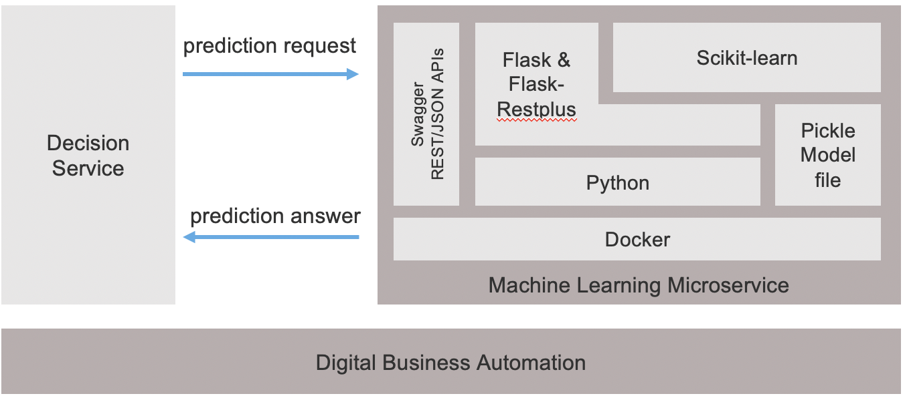
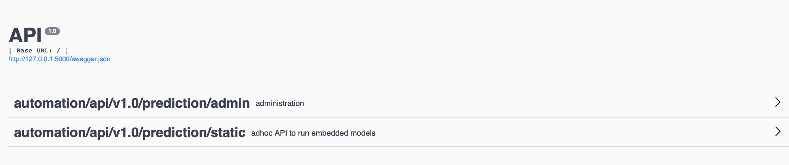
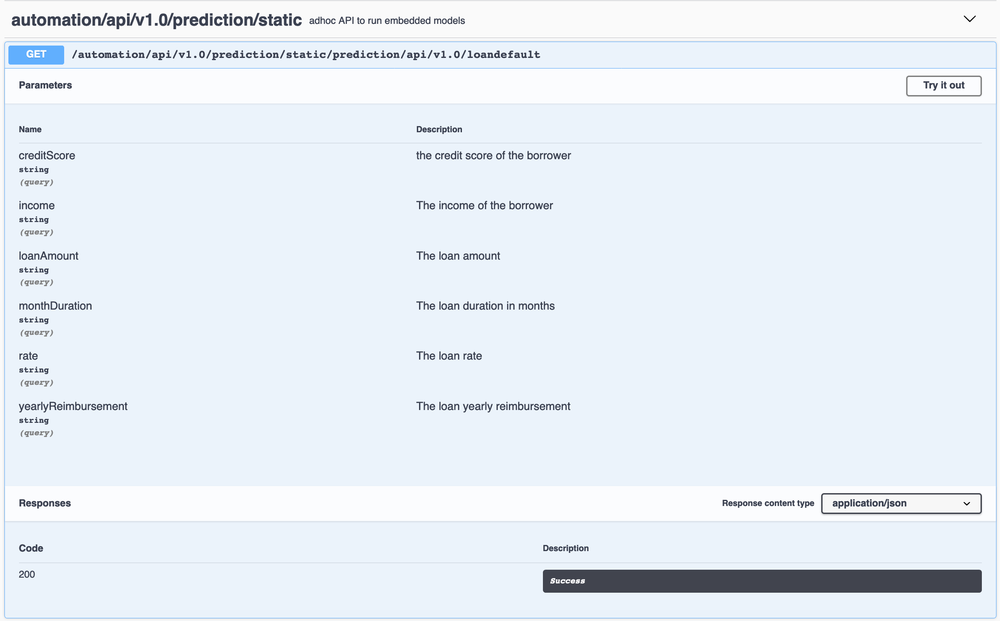
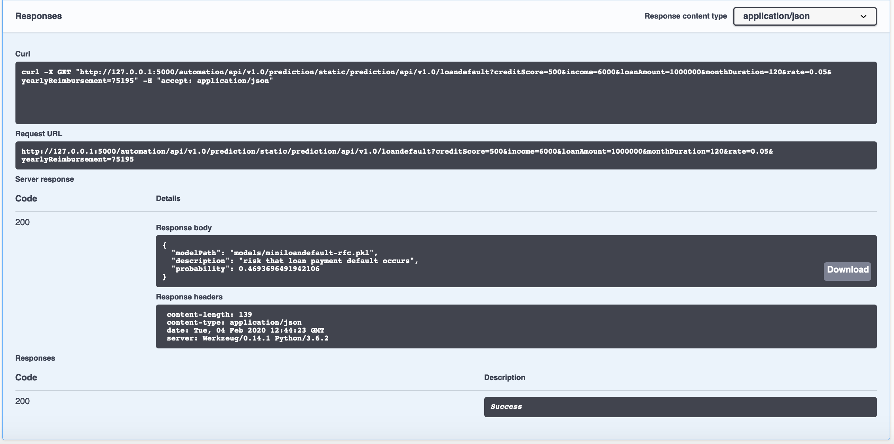

# Miniloan prediction micro service

A simple example of ML running microservice for real time machine learning based on Python, Flask, scikit-learn and Docker.
On request arrival for prediction, a Random Forest Classification model is loaded and run to predict a loan payment default.
Input parameters describing the loan are passed as HTTP parameters. Prediction is returned by the service.

 
 
## Build the ML microservice
```console
docker build . -t miniloanpredictionservice  -f ./Dockerfile
```
## Run the ML microservice
```console
docker run -p 3000:5000 -d miniloanpredictionservice 
```
Your predictive service is ready to predict on the 127.0.0.1:3000 port.
Note that you can run the server without Docker by starting main.py on your local environment. In this case adress will be 0.0.0.0:5000.

## Check
```console
docker ps miniloanpredictionservice 
```
You should see a running container for miniloanpredictionservice image.

## Go to the OpenAPI descriptor page
The microservice publishes its REST methods through the OpenAPI standard.
You navidate to the OpenAPI page at the root of the wepp application.
```console
http://127.0.0.1:3000/ 
```
You should see a SwaggerUI layout listing the exposed REST methods.


Open the predictive method.


Fill input parameters in the UI to execute the REST endpoint.


After hitting the execute button you then gets the following screen.


Congratulations! You obtained a risk score computed by the scikit-learn ML model.
In the JSON response you see the probability of a payment default.

You can conduct other tests in the OpenAPI window, OpenAPI generated clients or through a curl command.

## Summary
You have experimented a lightweight approach to host a scikit-learn ML model and expose it through a REST method.
The Docker image includes the ML model prepared by a data scientist and shared as a pickle file.

Next step will consist in consuming the predictive REST method from an IBM Automation engine running your business logic.

